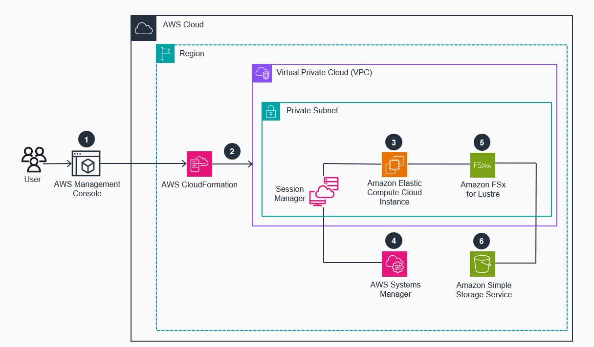
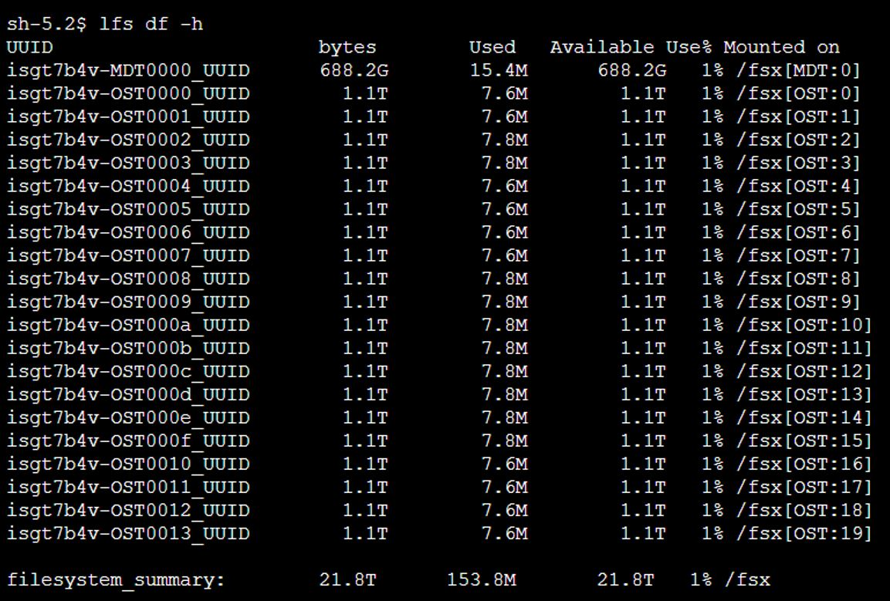

# Guidance for deploying a PoC of Amazon FSx for Lustre


## Table of Contents

1. [Overview](#overview)
2. [Methodology for conducting a PoC](#Methodology-for-conducting-a-PoC)
3. [Example of a PoC key success criteria matrix](#Example-of-a-PoC-key-success-criteria-matrix)
4. [FSx for Lustre configuration guidance](#FSx-for-Lustre-configuration-guidance)
5. [Prerequisites](#Prerequisites)
6. [PoC deployment steps](#PoC-Guidance-deployment-Steps)
7. [Deployment validation](#Deployment-Validation)
8. [Running the Guidance and PoC testing](#Running-the-Guidance-and-PoC-testing)
9. [Next Steps and testing for different scenarios](#Next-Steps-and-testing-for-different-scenarios)
10. [Cleanup](#cleanup)

<br/><br/>

## Overview

**Proof-of-Concept (PoC)** deployments that are not sized or configured correctly to reflect your actual workload requirements, along with PoC's that have undefined key success criteria, can lead to non-optimal PoC outcomes, and increased technology evaluation cycles.

This Guidance provides users with a **self-service proof-of-concept (PoC) guide**, which includes example AWS CloudFormation deployment templates, and configuration guidance to help users deploy & configure optimal configurations of Amazon FSx for Lustre for Proof-of-Concept testing scenarios. The objective of this guide is to enable more informed deployment configurations of FSx for Lustre during PoC exercises. By using the PoC configuration guidance and the sample CloudFormation PoC environment deployment templates, you can quickly setup, configure, and test a high performance FSx for Lustre file system, and evaluate its suitability for your workload, across performance, scale, integration and functional testing. You can test the deployed FSx for Lustre file system with your own applications/tools, or with the example tools we have provided.


Amazon FSx for Lustre is a fully managed file system that is optimized for high-performance workloads. It provides a native Lustre file system experience, with the scalability, performance, and availability that customers expect from the Lustre file system, combined with the simplicity, cost-effectiveness, and security of a fully managed service.

Amazon FSx eliminates the traditional complexity of setting up and managing high-performance Lustre file systems, allowing you to spin up, run, and scale a high-performance file system that provides sub-millisecond access to data stored in the Lustre file system, in minutes. FSx for Lustre also provides multiple deployment options for cost optimization. Amazon FSx for Lustre also integrates with Amazon S3, making it easy to process cloud data sets with the Lustre high-performance file system. When linked to an S3 bucket, an FSx for Lustre file system transparently presents S3 objects as files and can automatically update the contents of the linked S3 bucket as files are added to, changed in, or deleted from the file system.



<br/><br/>

### Cost

You are responsible for the cost of the AWS services used while running this Guidance. The cost for running this Guidance is based on your deployment values for the following AWS resources:
* **Amazon EC2** - This Guidance by default will deploy a single c6in.8xlarge EC2 instance. This EC2 instance type provides 50Gbps of dedicated network throughput capability (vs burst network bandwith), along with 32vCPU & 64GB RAM. Post Guidance deployment, you can change the EC2 Instance type as required, and deploy more EC2 instances as required by your testing.
* **Amazon FSx for Lustre** - You have the option to deploy a SCRATCH-SSD or PERSISTENT-SSD based file system, each of which have different associated pricing. [Refer to Amazon FSx for Lustre pricing details](https://aws.amazon.com/fsx/lustre/pricing/)
* **Amazon S3** - Any data that your store, and access in the S3 bucket that this is provisioned for S3-Linked FSx for Lustre file system deployments as per of this Guidance. By default no data is stored in the provisioned S3 bucket.


_We recommend creating a [Budget](https://docs.aws.amazon.com/cost-management/latest/userguide/budgets-managing-costs.html) through [AWS Cost Explorer](https://aws.amazon.com/aws-cost-management/aws-cost-explorer/) to help manage costs. Prices are subject to change. For full details, refer to the pricing webpage for each AWS service used in this Guidance._

### Sample Cost Table

As an example, if you deploy this Guidance with its default **c6in.8xlarge** EC2 Instance type, and also deploy a **9600GiB** FSx for Lustre SCRATCH-SSD based file system (which provides **1920 MB/s Throughput Capacity**) in the US-East (N. Virginia) region, as of April 2025 the cost to run this Guidance is approximately **$2,670.08 USD per-month**. 
The cost breakdown is provided as below, where you values will differ based on the type and size of the EC2 instance and FSx file system you deploy.

| AWS service  | Dimensions | Example sizing |  Example cost [USD]  |
| ----------- | ------------ | ------------ | ------------  |
| Amazon FSx for Lustre  | $0.140 per GB-month for SCRATCH-SSD file system | 9,600 GiB  | $ 1,345.54 per-month |
| Amazon EC2 | $1.8144 per-hour for c6in.8xlarge instance | Single c6in.8xlarge instance | $ 1,324.51 per-month |

<br/><br/>

## Methodology for conducting a PoC

- Define your workload requirements, the desired PoC outcomes
Create a key success criteria matrix for your PoC that includes output items such as:
- Performance (i.e. IOPS, throughput, latency, application specific metrics).

  **Note**: When looking to measure performance, it's important to understand factors such as, the read-to-write ratio & IO profile of your workload, file size distribution, the number of clients that will concurrently accessing the FSx for Lustre File system, and also the Amazon EC2 instance type capabilities (CPU/memory/network), that you will use to host your application.

- Integration, data access, monitoring, and any specific application requirements

- Identify and obtain the tools/applications that you will use to perform your testing

- Characterize and create any required datasets that will be used for testing

- Identify and obtain the required AWS privileges for deployment of your PoC components in AWS. Refer to prerequisites for further information

- Deploy your PoC environment when you have the above items ticked off.

- Tune the FSx Lustre File system based on your data profile

- Evaluate the elements defined in your PoC key success criteria matrix through testing in the PoC environment

- Test again as required by tuning your application, FSx for Lustre instance or EC2 Instance type.

- Tear-down your PoC environment as required.

<br/><br/>

## Example of a PoC key success criteria matrix

Below is an example PoC key success criteria table that you can populate when you run your different PoC configuration and test scenarios. Prior to conducting a PoC, it's important to take note of your **workload configuration**, below are some of the suggested items to obtain value for. As you navigate through this document you will obtain guidance to help you update the Amazon FSx for Lustre configuration section.

### Scenario 1:

**Workload configuration**

| Item | PoC Value |
|------|-----------|
| Amazon EC2 compute instance type to be used by workload |  |
| Network throughput capability of Amazon EC2 instance selected |  |
| Number of concurrent compute nodes, or threads used for testing |  |
| Workload data set size |  |
| Average file size or size distribution |  |
| Data read/write access ratio |  |
| Data sequential/random access ratio |  |

<br/><br/>

**Amazon FSx for Lustre configuration** 

| Item | PoC Value |
|------|-----------|
| Storage type deployed |  |
| Provisioned Storage capacity |  |
| Provisioned Throughput per-unit of storage (per-TiB) |  |
| Metadata IOPS provisioned (auto or provisioned) |  |
| Compression enabled (Y/N) |  |
| S3-Linked FSx file system (Y/N) |  |


<br/><br/>

**Performance testing**

| Metric | Target value | PoC value |
|------------------------------|--------------|-----------|
| Latency (ms) |  |  |
| Throughput (MB/s) |  |  |
| IOPS |  |  |
| Application specific performance metric(s) |  |  |
| Workload job duration time (short vs long jobs) |  |  |

<br/><br/>

**Functional testing**

| Feature | Outcome |
|-------------------|---------|
| Scale Throughput per-unit of storage capacity (up or down) |  |
| Scale up storage capacity |  |
| Test automatic metadata import from Amazon S3 into FSx for Lustre file system |  |
| Test automatic export of data to Amazon S3 from FSx for Lustre file system |  |

<br/><br/>

## FSx for Lustre configuration guidance

You can deploy an FSx for Lustre file system in two configurations:
1. A standalone FSx for Lustre file system:
2. An FSx for Lustre file system that is linked to an S3 data repository (S3 bucket)

Use an S3-linked FSx for Lustre file systems for scenarios where you need to access large datasets stored in an S3 Bucket for use-cases such as, Machine Learning and training, HPC simulations, and big data analytics.

#### Storage deployment type:

Choose between either a Persistent-SSD, Scratch-SSD, or Persistent-HDD Storage deployment type. For this PoC guide, we are going to focus on Persistent-SSD & Scratch-SSD storage deployment types.

Persistent-SSD deployment is recommended for mission-critical, long-running workloads that require the highest level of availability, for example HPC simulations, big data analytics or Machine Learning training.

Scratch-SSD deployments are suitable for workloads that are ephemeral or short-lived.

#### Storage capacity:

The minimum storage capacity you can provision is 1.2TB. Any capacity required above 1.2TB needs to be provisioned in increments of 2.4TB (2.4, 4.8, 7.2, etc.). The throughput of an FSx for Lustre file system scales linearly with storage capacity, where the storage capacity of a filesystem can be increased dynamically after the filesystem's initial deployment. The provisioned storage capacity not only provides the amount of storage space your data can utilize, it also influences performance of the file system. FSx for Lustre stores data within  **[Object Storage Targets (OST's)](https://docs.aws.amazon.com/fsx/latest/LustreGuide/performance.html#storage-layout)**, where the amount of provisioned storage capacity determines the number of OSTs provisioned for your Lustre file system. The number of OSTs your Lustre file has provisioned dictates the maximum Lustre stripe count available to strip your large files across the backend OSTs.

#### Throughput per unit of storage:

Throughput for the entire filesystem is calculated based on the amount of provisioned storage (in TiB), multiplied by the throughput-per-unit of storage configured (in MB/s). The throughput-per-unit of storage value can be modified dynamically (once every 6 hours) after the filesystem is deployed. Scratch file system have a fixed throughput unit of 200MB/s per-TiB.

Example: If your application required 4TiB of persistent storage capacity and requires 2,000MB/s of aggregate throughput, then:

- You could provision a FSx for Lustre file system with 4.8TiB of Persistent-SSD storage capacity, with 500MB/s per-TiB of throughput capacity. This will provide 2400MB/s of **[aggregate baseline disk throughput capability](https://docs.aws.amazon.com/fsx/latest/LustreGuide/performance.html#fsx-aggregate-perf)** (4.8TiB * 500MB/s per-TiB storage throughput capacity = 2400MB/s).

- Alternatively, you could provision 9.6TiB of Persistent-SSD storage capacity, with 250MB/s per-TiB throughput capacity to achieve the same 2400MB/s of aggregate baseline disk throughput capability (9.6TiB * 250MB/s  per-TiB of throughput capacity = 2400MB/s).

- This second configuration will provide more storage capacity and also more backend OST nodes that you can use to to further stripe your data across. This can be helpful when you have large GB size files for your workload, and can distribute the stripe of these large files across many OST nodes.

**Note**: Use the **[AWS pricing calculator](https://calculator.aws/#/estimate)** to model the cost of different FSx storage& throughput capacity options available for your specific requirements (such as above).

#### Metadata Configuration:

Metadata IO operations (such as, open, close, get attributes, set attributes, lock, unlock, etc.) will represent a greater portion of overall operations when a filesystem is composed of very small files (<16KB), and there are many file operations on very small files vs large files. For most applications, the default Metadata configuration of FSx for Lustre will provide sufficient metadata IOPS. If your workload is comprised of lots of small KB sized files, **[monitor the Metadata performance IOPS metrics within the FSx for Lustre console's Monitoring & Performance dashboard](https://docs.aws.amazon.com/fsx/latest/LustreGuide/monitoring-cloudwatch.html)**. Update the Metadata IOPS performance dynamically as required.

#### Data compression:

Enable data compression if you have file types that can be compressed. This can help to increase performance as data compression reduces the amount of data that is transferred between FSx for Lustre file servers and storage. FSx for Lustre automatically compresses newly-written files using the LZ4 algorithm before they are written to disk and automatically uncompresses them when they are read. Enabling data compression does not typically have a measurable impact on latency. You can enable or disable data compression on an existing FSx for Lustre file system.

#### Data Repository Association

You can link your FSx for Lustre file system to an S3 bucket using a **[Data Repository Association](https://docs.aws.amazon.com/fsx/latest/LustreGuide/fsx-data-repositories.html)**, which will allow automatic import/export of data from/to Amazon S3. You can utilize FSx for Lustre as a high-performance cache for data stored in an S3 bucket. When your FSx file system is created, the names and prefixes of objects in your S3 bucket will appear as files and directory listings on the file system. The actual content of a given object is imported automatically from Amazon S3 when you access the associated file on the FSx for Lustre file system for the first time. Subsequent access to the file will be served directly from the Lustre file system.

#### Dynamic scaling of storage capacity and performance

Once you have deployed an FSx for Lustre file system, you can dynamically adjust the following:

- Increase Storage capacity for Scratch and Persistent-SSD based FSx for Lustre file system when additional storage capacity, or additional throughput and disk performance is required.  When you increase the file system capacity, Amazon FSx automatically adds new network file servers and scales your metadata servers.

**Note**: You can only update storage capacity 6 hours after a previous storage capacity updated has completed

When scaling storage capacity, the file system may become unavailable for a few minutes for the update to complete.

- Update Throughput per-unit of storage (throughput capacity) for Persistent-SSD based FSx for Lustre file systems, where you can increase/decrease the Throughput per-unit of storage once every 6 hours. You may want to increase the throughput capacity in certain scenarios, such as:

When you require more baseline throughput capacity performance and not additional storage capacity, or when you're your workload requires extra throughput capacity performance for a period of time (i.e. end of month batch processing). You can then decrease the throughput capacity value when you don't need that extra performance.

**Note**: When you modify your file system's throughput capacity, behind the scenes, Amazon FSx switches out the file system's file servers. Your file system will be unavailable for a few minutes during throughput capacity scaling

- Update Metadata IOPS value for Persistent-SSD based FSx for Lustre file systems, where you can select to update between Automatic or User-provisioned Metadata IOPS values.

**Note**: While updating metadata IOPS, the file system may be unavailable for a few minutes. File operations issued by clients while the file system is unavailable will transparently retry and eventually succeed after scaling is complete.

#### Amazon EC2 compute instance guidance

When launching EC2 instances for your compute-intensive workload, choose instance types that have the GPU/CPU, memory, and dedicated network performance that your application requires. For example you could use **[C6in instance types](https://aws.amazon.com/ec2/instance-types/c6i/)** or **[Hpc7g instance types](https://aws.amazon.com/ec2/instance-types/hpc7g/)** which are designed for compute-intensive workloads with dedicated network bandwdith and/or EFA support. Selecting the appropriate EC2 compute instance(s) for your application, will enable you to better leverage the performance capabilities of the FSx for Lustre file system. When selecting the EC2 Instances for your application, take note of the **[baseline Gbps network bandwidth per EC2 instance type](https://docs.aws.amazon.com/ec2/latest/instancetypes/co.html#co_network)**, and select instances that are network optimized, and have dedicated baseline network throughput vs burst for network throughput. If you are using EC2 instances with more than 64GiB of memory or 64 vCPU, **[then apply these performance tips](https://docs.aws.amazon.com/fsx/latest/LustreGuide/performance.html#performance-tips)**.

#### Elastic Fabric Adapter (EFA):

If your application requires high levels of network throughput, then you can look at using **[Elastic Fabric Adapter (EFA)](https://docs.aws.amazon.com/AWSEC2/latest/UserGuide/efa.html)** in your architecture. EFA is a network interface that provides low-latency, high-throughput communication for distributed applications running on EC2 instances. You can **[select EC2 Instance compute types that support EFA](https://docs.aws.amazon.com/AWSEC2/latest/UserGuide/efa.html#efa-instance-types)**, and also deploy **[persisent-SSD based FSx for Lustre file systems with EFA enabled](https://aws.amazon.com/blogs/aws/amazon-fsx-for-lustre-unlocks-full-network-bandwidth-and-gpu-performance/)**. For high performance GPU based workloads, note that FSx for Lustre supports NVIDIA GPUDirect Storage (GDS), where GDS is a technology that creates a direct data path between local or remote storage and GPU memory.

If you are selecting an EC2 instance for your workload that supports EFA, it's highly recommended to enable EFA on that EC2 instance, as EFA reduces network latency and increases network bandwidth for FSx for Lustre file system access. For EFA configuration, ensure the Lustre client software on your EC2 instances is configured to leverage the EFA network interface, and that it is **[configured optimally](https://docs.aws.amazon.com/fsx/latest/LustreGuide/configure-efa-clients.html)**. This typically involves setting the appropriate Lustre mount options, such as **osd_timeout , rmtclient_timeout** and **max_read_ahead_mb.**

<br/><br/>

## Prerequisites

- Identify any test data that will be required for use in the PoC (or that will be created in PoC environment).
- Take note that each FSx for Lustre file system requires the following:
  - A VPC Security group with [inbound/outbound port rules](https://docs.aws.amazon.com/fsx/latest/LustreGuide/limit-access-security-groups.html#fsx-vpc-security-groups). The PoC CloudFormation template that you will deploy will create/configure a VPC Security group to allow access to the FSx instance from the deployed Amazon EC2 host.
  - One IP address for each metadata server (MDS) and one IP address for each storage server (OSS). In the CloudFormation deployment template that is provided, you an specify your CIDR value.
- **[Refer to the full list of prerequisites here](https://docs.aws.amazon.com/fsx/latest/LustreGuide/getting-started.html)**

### Operating System

- All installable packages/modules are deployed as part of the PoC guidance CloudFormation template.
- The Amazon Linux 2023 AMI has been used as the base OS for the deployed EC2 instance.


### AWS account requirements

- Access to the AWS Console or AWS CLI, with the required IAM privileges to deploy the AWS CloudFormation deployment templates, and create/manage AWS resources.
- You can run the below example commands (on a Linux based client) to verify if your role has the access required access to create AWS resources required for the PoC guidance deployment [Amazon EC2, Amazon S3, Amazon FSx, AWS CloudFormation, AWS IAM]

**Get my user's identity**

```bash
MYARN="$(aws sts get-caller-identity --query Arn | tr -d '"')"
```

**Below are examples of how you can check if you have the required permissions to create an FSx instance, EC2 instance, S3 bucket and a VPC Security Group**
```bash
aws iam simulate-principal-policy --policy-source-arn $MYARN --action-names "fsx:CreateFileSystem" | grep -i decision
aws iam simulate-principal-policy --policy-source-arn $MYARN --action-names "ec2:CreateSecurityGroup" | grep -i decision
aws iam simulate-principal-policy --policy-source-arn $MYARN --action-names "ec2:CreateInstance" | grep -i decision
aws iam simulate-principal-policy --policy-source-arn $MYARN --action-names "s3:CreateBucket" | grep -i decision

```

**Resources deployed as per this guidance:**
- Amazon VPC & Internet Gateway
- Amazon EC2
- Amazon FSx for Lustre
- Amazon S3 bucket
- AWS IAM role

<br/><br/>

## PoC Guidance deployment Steps

#### Deploying a FSx for Lustre file system in a new PoC VPC environment using CloudFormation

To get started and deploy this PoC Guidance, use AWS CloudFormation to deploy one of the below CloudFormation templates (YAML files) based on your required FSx for Lustre file system deployment type (i.e. Persistent-SSD or Scratch), and whether you require a standalone FSx file system, or an S3-linked FSx file system.

| FSx file system type| File system mode : Standalone or S3-linked | CloudFormation template |
| ----------- | ------------ | ------------ | 
| Persistent-SSD | Standalone FSx for Lustre file system  |  [Persistent2_standalone_fs.yaml](https://github.com/aws-solutions-library-samples/guidance-for-deploying-a-poc-for-amazon-fsx-for-lustre/blob/main/assets/code/persistent_standalone_fs.yaml) |
| Persistent-SSD | S3-Linked FSx for Lustre file system | [Persistent2_s3_linked_fs.yaml](https://github.com/aws-solutions-library-samples/guidance-for-deploying-a-poc-for-amazon-fsx-for-lustre/blob/main/assets/code/persistent_s3_linked_fs.yaml) |
| Scratch | Standalone FSx for Lustre file system  | [scratch2_standalone_fs.yaml](https://github.com/aws-solutions-library-samples/guidance-for-deploying-a-poc-for-amazon-fsx-for-lustre/blob/main/assets/code/scratch2_standalone_fs.yaml) |
| Scratch | S3-Linked FSx for Lustre file system | [scratch2_s3_linked_fs.yaml](https://github.com/aws-solutions-library-samples/guidance-for-deploying-a-poc-for-amazon-fsx-for-lustre/blob/main/assets/code/scratch2_s3_linked_fs.yaml) | 

Each of the sample AWS CloudFormation YAML templates provided in this Guidance will deploy the following:

- A new Amazon VPC with a private subnet, a public subnet and Internet Gateway.
- A single Amazon EC2 instance with Amazon Linux 2023 is deployed in the private subnet, providing you with a default compute node you can use to test with, and which has access to the deployed PoC VPC resources. The deployed compute node is configured with the **[Amazon Systems Manager](https://docs.aws.amazon.com/systems-manager/latest/userguide/what-is-systems-manager.html)**, providing an easy way to access a CLI session on the compute node.

  - **Note**: By default, a **[c6in.8xlarge EC2 instance](https://aws.amazon.com/ec2/instance-types/c6i/)** is deployed by these example CloudFormation templates as an initial compute testing node. It is highly recommended to update this EC2 Instance type to the type required by your workload, and/or deploy the appropriate number of EC2 instances as required by you workload for any distributed testing scenarios. **[Click here for more information](\https:\docs.aws.amazon.com\ec2\latest\instancetypes\co.html#co_network)** on baseline network performance and EFA capability per EC2 instance type.

- An Amazon FSx for Lustre instance in the private subnet
- An Amazon S3 bucket (if you selected to deploy a S3-linked FSx for Lustre file system)

**Note**: After you have deployed the guidance and it has created the PoC VPC for you, If you want to deploy any additional EC2 instances that need to access the FSx file system, ensure the EC2 instances are added to the VPC security group of **FSxLustrePoCSecurityGroup**. 

#### Deploying the Guidance CloudFormation template

1. Download one of the provided CloudFormation templates (YAML files) from above, based on your required FSx for Lustre file system.   
- Navigate to the **[AWS CloudFormation console](https://console.aws.amazon.com/cloudformation)**
  - Select **Create stack** with new resources
  - Click on the **Upload a template file**, and select the the CloudFormation template you downloaded.
  -  Select **Next** and follow the instructions to deploy the stack
  - Refer to the **output** tab of the deployed AWS CloudFormation stack, which will provide details of the AWS resources created and their ID's.
  - **IMPORTANT**: Wait until your stack shows a status of **CREATE_COMPLETE** before proceeding to the next step.

#### Mounting the FSx for Lustre file system on the deployed EC2 instance

1. Obtain the mount details of the FSx file system 
- Navigate to the **[Amazon FSx console](https://console.aws.amazon.com/fsx)**
  - Select your FSx for Lustre instance name
  - Click on the **Attach** button 
  - In the pop-up, under the "Attach instruction - using the default DNS name" section, you are provided with the exact commands to easily mount the FSx file system on an EC2 instance. Copy these mount commands exactly as shown into a notepad file, as you will use them in **step 3** below to mount the FSx file system. The mount commands shown will firstly create a directory called "/fsx", and then mount the Lustre file system on "/fsx".

2. Log into your deployed EC2 instance using Session Manager.
- Navigate to the **[Amazon EC2 console](https://console.aws.amazon.com/ec2)**
  - Select the instance and choose **Connect**.
  - For the connection method, choose **Session Manager**.
  - Choose **Connect** to start the session. The connect button may take a moment to become accessible when you connect to the EC2 instance using Amazon Systems Manager for the very first time.
  - **Note**: You can change the default session timeout value for Session Manager sessions to the EC2 instance by [following these instructions.](https://docs.aws.amazon.com/systems-manager/latest/userguide/session-preferences-max-timeout.html)

3. Install Lustre client on the EC2 instance and mount FSx file system.
- Use the below command to install the Lustre client on the EC2 Instance that you have logged into (these instructions are for Amazon Linux 2023 OS). 
  - **Note**: To install the Lustre client on different OS types that you might deploy, **[refer to installing Lustre client software](https://docs.aws.amazon.com/fsx/latest/LustreGuide/install-lustre-client.html)**. If you deploy more EC2 Instances for your PoC testing, you will need to install the Lustre client on each EC2 Instance that will access the FSx file system.

```bash
sudo dnf install -y lustre-client
```


- Run the mount commands that you copied from **Step 1** into the command prompt to create first a folder called **/fsx** , and then mount the FSx for Lustre file system on the **/fsx** folder path.
- Run the below command to view your mounted FSx for Lustre instance on */fsx*

```bash
df -h
```

- If you have more than one compute instance, run these commands on each required compute to mount the Lustre file system.
Review the Post deployment performance tips section below, before copying data to your FSx instance


<br/><br/>

## Deployment Validation

You can validate a successful deployment by:

Navigate to the **[AWS CloudFormation console](https://console.aws.amazon.com/cloudformation)** and verify that the status of the CloudFormation stack that you deployed is showing **CREATE_COMPLETE**.

<br/><br/>

## Running the Guidance and PoC testing

Before commencing with PoC testing scenario's with the deployed PoC VPC environment, lets take a look at some post deployment tips for FSx for Lustre.


#### Post deployment performance tips

**Lustre striping configuration**

By default, a 4-component Lustre striping configuring is created for you via the Progressive file layouts (PFL) capability of FSx for Lustre, refer to **[Progressive file layouts](https://docs.aws.amazon.com/fsx/latest/LustreGuide/performance.html#striping-pfl)** for further information. This capability defines different stripe sizes and counts based on the different file sizes that are copied to the file system. A PFL configuration can help simplify managing a file system that has mixed sized files. The default 4-component striping layout of the Progressive file layouts is:

- A stripe count value of 1 for files up to 100MiB in size.
- A stripe count of 8 for files up to 10GiB in size.
- A stripe count of 16 for files up to 100GiB in size.
- A stripe count of 32 for files larger than 100GiB.

**Note**: For all file systems regardless of their creation date, files imported from Amazon S3 using Data Repository Association (DRA) don't use the default PFL layout, but instead use the layout in the file system's **ImportedFileChunkSize** parameter. S3-imported files larger than the ImportedFileChunkSize will be stored on multiple OSTs with a stripe count based on the ImportedFileChunkSize defined value (default 1GiB).

In most cases you don't need to update the default PFL Lustre stripe count/size. However, if your data profile (i.e. file size distribution across dataset/folders) requires a specific Lustre striping configuration (i.e. based on your file size(s) and/or the number of OST's for your file system), then refer to the below section to understand configuring your own Lustre striping configuration.


**Stripe Count**


The stripe count specifies the number of Object Storage Target's (OST's) that will hold chunks of a striped file, on the FSx for Lustre file system. Tuning the stripe count can help distribute chunks of a file across the number of OST's that store the data of the FSx for Lustre file system. A higher stripe count can improve performance in terms of aggregate throughput, especially for files larger than 1Gb. A good starting point is 4-8 stripes. The default is stripe count is 1 for all objects less than 1Mb, or 5 for over 1MB.

View the number of OST's that your FSx file system is bound across.

```bash
lfs df -h
```




View the current stripe count. (i.e. your mountpath would be /fsx in this Guidance)
```bash
lfs getstripe -d /<mountpath>
```


**Stripe Size**


The stripe size determines the amount of data stored on each OST per file before moving to the next OST to store the file data. The default value is 1MiB, where setting a stripe offset may be useful in special circumstances, but in general it is best to leave it unspecified and use the default value, and the default Progressive file layout (PFL) used by FSx for Lustre. If you do need to change the striping then, you can use the example syntax below. 

```bash
sudo lfs setstripe -c <value> -S <value> /<mountpath>
```

Stripe parameters:

```bash
-c | Stripe count | 0 = use system default, -1 = stripe across all available OSTs, or provide your own count value
-S | Stripe size | 0 = use default system size, or set to a value using M (for MB) or G (for GB) (i.e. 1G for 1GB)
```

**Note:** Do not set the stripe count to be greater than your OST count.

Refer to **[Striping data in your file system](https://docs.aws.amazon.com/fsx/latest/LustreGuide/performance.html#striping-data)** for further information

**ImportedFileChunkSize**

If your files are imported from an S3 data repository, you can stripe high-throughput files across OSTs by tuning the ImportedFileChunkSize value.

For example, suppose that your workload uses a 7.2 TiB file system (which is made up of 6 x 1.17-TiB OSTs) and needs to drive high throughput across 2.4 GiB files. In this case, you can set the ImportedFileChunkSize value to (2.4 GiB / 6 OSTs) = 400 MiB so that your files are spread evenly across your file system's OSTs.

#### Testing the FSx for Lustre file system
Testing performance
It is recommended to use your own application or specific load generation tool that best reflects the data profile and usage characteristics of your workload. If you do not have access to your own load generation tools, you can leverage benchmark tools, such as the **[Flexible I/O (FIO)](https://fio.readthedocs.io/en/latest/index.html)** generator tool, or **[IOR](https://ior.readthedocs.io/en/latest/)** to measure the file system's performance in terms of throughput, IOPS, and latency.

In the subsequent testing sections of this PoC guide, we will provide examples to get your started with using the fio tool, and a single EC2 compute node to test the Lustre file system with. Your actual workload may require many computes nodes to access the file system concurrently, hence its recommended to also test the deployed FSx for Lustre file system with the additional compute nodes that you require (which you can deploy into the PoC VPC).

#### Throughput testing

1. Log into the EC2 instance that you installed the Lustre client on to.

2. Install your application load testing tool, or run the below command to install FIO, as part of this PoC deployment.

```bash
sudo yum -y install fio
```
3. Lets navigate to the path that we mounted the FSx for Lustre file system on the EC2 instance (i.e. /fsx), and create a new directory to host your testing data.

```bash
sudo mkdir /fsx/performance
cd /fsx/performance
```


4. Run your application load testing tool to test the throughput performance and latency of the FSx for Lustre file system. If you don't have your own performance testing tools, you can use the below instructions, which will use the fio tool (that you installed) to generate an IO load on the FSx file system based on a 1MB block size

The below example fio command will:
- Create a 10GB test file called ***mytestfile*** under ***/fsx/performance***
- Generate an IO load pattern with a 50/50 read/write ratio, random read/write pattern with a block size of 1MB, with job runtime duration of 120 seconds.

```bash
sudo fio --name=fiotest-throughput  --filename=/fsx/performance/mytestfile --direct=1 --rw=randrw  --rwmixread=50 --bs=1MB --size=10GB --ioengine=libaio --iodepth=64  --numjobs=2 --randrepeat=1 --group_reporting --runtime=120 --time_based
```

Below is an output of the above example fio test command. At the bottom of the output, you are provided with the ***READ & WRITE*** bandwidth achieved in terms of ***MiB/s*** for the fio command taht was run. The fio output values that you obtain when you run this command will vary based on the configuration of your FSx file system size and striping, EC2 instance type and configuration, and fio load testing parameters selected.


**fio parameters:**
You can use your own values for the fio parameters, based on your actual workload requirements. [Refer to the Flexible I/O (FIO) generator tool for further information on configurable parameters](https://fio.readthedocs.io/en/latest/index.html)

```bash
--bs = block size
--iodepth = io depth
--size = size of your test file for the IO load test
--readwrite = read/write pattern for test
--rwmixread = read/write ratio for test
--numjobs = number of jobs in test
--runtime = length to run job in terms of seconds
```

#### Performance results

5. View the performance results using your own application tooling. You can also use the **[Amazon FSx console and it's integrated Amazon CloudWatch performance metrics dashboard to view the performance details](https://docs.aws.amazon.com/fsx/latest/LustreGuide/monitoring-cloudwatch.html)** (i.e. results of the fio tests conducted).


6. Compare the observed PoC performance metrics with your expected requirements, and enter your test results into the key success criteria matrix for each scenario that you run.

7. If the observed performance metrics do not meet your requirements, then make any required adjustments to your application stack across: your application, the EC2 instance types, EFA configuration, or Lustre file system (throughput, capacity, striping parameters) and re-run tests again.


#### Testing features and integration

**Dynamic scaling of provisioned Storage capacity**

- Navigate to the **[Amazon FSx console](https://console.aws.amazon.com/fsx)**
- Select your FSx Instance
- Click on **Action** 🡪 **Update storage capacity**
- Update capacity in increments of 2400GB
- Select **Update**
- Monitor the **Updates** tab within the FSx console for update operation to show a completed status, before using the file system for any testing

**Dynamic scaling of provisioned Throughput per-unit of storage (Persistent storage only)**

- Navigate to the **[Amazon FSx console](https://console.aws.amazon.com/fsx)**
- Select your FSx Instance
- Select **Actions** 🡪 **Update Throughput tier**
- Increase or decrease Throughput value as required
- Select **Update**
- Monitor the **Updates** tab within the FSx console for update operation to show a completed status, before using the file system for any testing

**Dynamic scaling of Metadata IOPS (Persistent storage only)**
- Navigate to the **[Amazon FSx console](https://console.aws.amazon.com/fsx)**
- Select your FSx Instance
- Select **Actions** 🡪 **Update Metadata IOPS**
- Select between Automatic or User-provisioned Metadata IOPS values
- Select **Update**
- Monitor the **Updates** tab within the FSx console for update operation to show a completed status, before using the file system for any testing

#### Amazon S3 integration for automatic import and export of data (only for S3-Linked FSx for Lustre file systems)
Perform the below actions to test the FSx for Lustre & S3 automatic import/export capability.

**Note**: You can view the name of the S3 bucket linked to your FSx file system within the FSx console, it's under the FSx Instance's Data repository tab details.

**Connect to EC2 instance:**
- Navigate to the **[Amazon EC2 console](https://console.aws.amazon.com/ec2)**
- In the navigation pane, choose **Instances**
- Select the instance and choose **Connect**
- For the connection method, choose **Session Manager**
- Select **Connect** to start the session

**Test the automatic export of data to an S3 bucket, for data created/modified on the FSx file system**

- Create one or more new files on the mount-point that is hosting the FSx file system (i.e. /fsx)
- Navigate to the **[Amazon S3 console](https://console.aws.amazon.com/s3)**
- Select your S3 bucket
- Refresh the screen to get the latest view of the data in your S3 bucket
- Verify the data you created on the mounted FSx file system, has been auto exported to the S3 bucket.


**Test the automatic import of metadata and data from S3, into the to FSx file system**
- Upload new data into your S3 bucket
- Navigate back to your EC2 compute node
- Navigate to your FSx for Lustre file system mount-point (i.e. /fsx)
- Perform a list operation ```ls -ltr```  on the directory to get the latest list of file metadata
- Verify that you can see the new file names in your directory (i.e. /fsx), for the new data you uploaded into S3 in the previous step.

<br/><br/>

## Next Steps and testing for different scenarios

As part of a PoC, you may want to validate different workload scenarios, or even a different workload on FSx for Lustre, by testing with different parameters/configurations in your PoC. Below are a few examples of different scenarios you could test for in your PoC VPC environment (if requierd).

- Read-only, read/write, or write only data workload patterns
- Long duration jobs (many hours) vs short duration (minutes)
- Different compute instance(s) types
- Number of concurrent client nodes accessing the FSx file system
- Different datasets, or files of different sizes

<br/><br/>

## Cleanup

Before deleting the deployed CloudFormation stack, you need to manually delete any new AWS resources you have manually created in the PoC VPC after deployment (i.e. additional EC2 compute instances, or new/updated IAM roles), and delte any data your have uploaded to the auto-created S3 bucket.

To delete the PoC Guidance:

- Navigate to the **[AWS CloudFormation console](https://console.aws.amazon.com/cloudformation)**
- Select the Cloudformation stack that you deployed as part of this Guidance, then select **Delete**
  - **Note:** AWS resources deployed by the PoC guidance CloudFormation template will be tagged with the name of the CloudFormation stack name you provided during deployment. (i.e. ```aws:cloudformation:stack-name: <your-stack-name>```)

<br/><br/>

## Notices

Include a legal disclaimer

**Example:**
*Customers are responsible for making their own independent assessment of the information in this Guidance. This Guidance: (a) is for informational purposes only, (b) represents AWS current product offerings and practices, which are subject to change without notice, and (c) does not create any commitments or assurances from AWS and its affiliates, suppliers or licensors. AWS products or services are provided “as is” without warranties, representations, or conditions of any kind, whether express or implied. AWS responsibilities and liabilities to its customers are controlled by AWS agreements, and this Guidance is not part of, nor does it modify, any agreement between AWS and its customers.*


## Authors
- Wali Akbari
- Sebastien Berube
